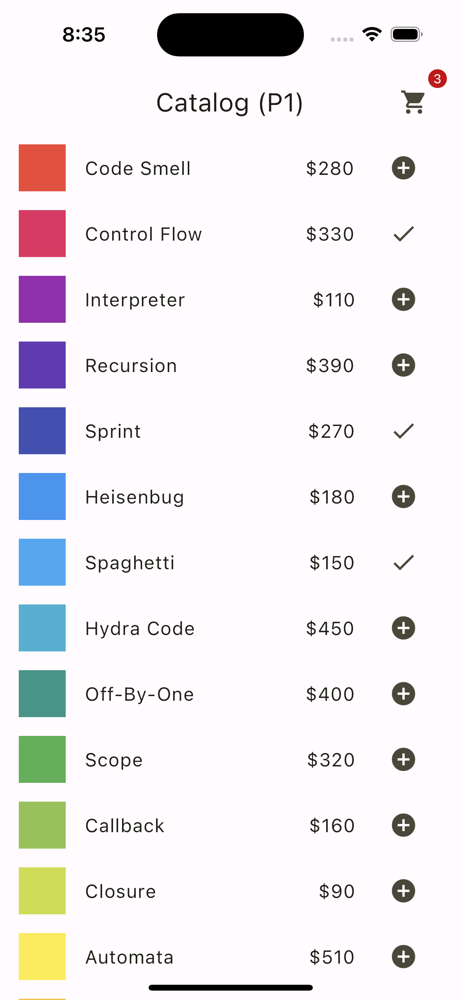
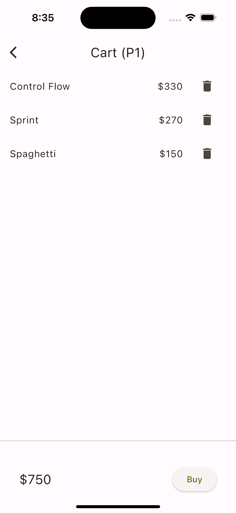

# Flutter state management
Implementationss of the app example from the [Simple app state management](https://docs.flutter.dev/data-and-backend/state-mgmt/simple) page of the official Flutter documentation, with various state management patterns.

 

## Patterns

| No. | Pattern | Code |
| --- | --- | --- |
| P1 | StatefulWidget only | [p1](./lib/p1) |
| P2 | ChangeNotifier | [p2](./lib/p2) |
| P3 | ChangeNotifier + InheritedWidget | [p3](./lib/p3) |
| P4 | ChangeNotifierProvider (Provider package) | [p4](./lib/p4) |
| P5 | Riverpod | [p5](./lib/p5) |
| P6 | Riverpod Generator | [p6](./lib/p6) |

### P1 / StatefulWidget only
- Lift up the state shared by multiple widgets to their parent widget.
- Relay that state to any descendant widget that needs it.
- Events that require state updates are also lifted up.

```dart
// lib/p1/p1_app.dart
class _P1AppState extends State<P1App> {
  // ⭐️ Lift up the state shared by multiple widgets to their parent widget.
  final Set<Item> myCartItems = {};

  @override
  Widget build(BuildContext context) {
    return MaterialApp(
      debugShowCheckedModeBanner: false,
      theme: ThemeData(
        colorScheme: ColorScheme.fromSeed(seedColor: Colors.yellow),
        useMaterial3: true,
      ),
      initialRoute: '/',
      routes: {
        '/': (context) => P1CatalogPage(
              // ⭐️ Relay that state to any descendant widget that needs it.
              myCartItems: myCartItems.toList(),
              // ⭐️ Events that require state updates are also lifted up.
              onAddItem: (item) => setState(
                () => myCartItems.add(item),
              ),
            ),
```

### P2 / ChangeNotifier

_T.B.D._

### P3 / ChangeNotifier + InheritedWidget

_T.B.D._

### P4 / ChangeNotifierProvider (Provider package)

_T.B.D._

### P5 / Riverpod

_T.B.D._

### P6 / Riverpod Generator

_T.B.D._
