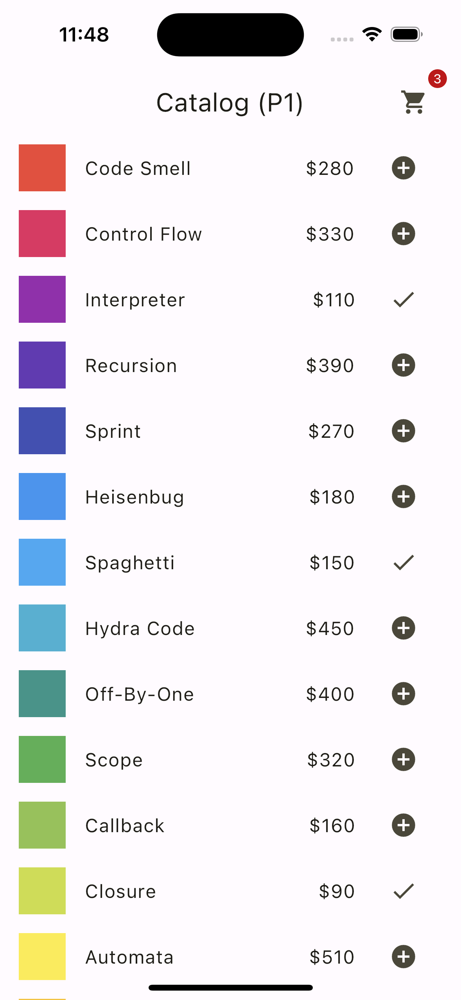

# Flutter state management
Implementations of the app example from the [Simple app state management](https://docs.flutter.dev/data-and-backend/state-mgmt/simple) page of the official Flutter documentation, with various state management patterns.

| Catalog | My Cart |
| :-: | :-: |
|  |  |

## Patterns

| No. | Pattern | Code |
| --- | --- | --- |
| P1 | [StatefulWidget only](#p1--statefulwidget-only) | [lib/p1](./lib/p1) |
| P2 | [ChangeNotifier](#p2--changenotifier) | [lib/p2](./lib/p2) |
| P3 | [ChangeNotifier + InheritedWidget](#p3--changenotifier--inheritedwidget) | [lib/p3](./lib/p3) |
| P4 | [ChangeNotifier + Provider](#p4--changenotifier--provider) | [lib/p4](./lib/p4) |
| P5 | [Riverpod](#p5--riverpod) | [lib/p5](./lib/p5) |
| P6 | [Riverpod Generator](#p6--riverpod-generator) | [lib/p6](./lib/p6) |
| P7 | [BLoC](#p7--bloc) | [lib/p7](./lib/p7) |
| P8 | [Scoped Model](#p8--scoped--model) | [lib/p8](./lib/p8) |
| P9 | [Redux](#p9--redux) | [lib/p9](./lib/p9) |

### P1 / StatefulWidget only
- Lift up the state shared by multiple widgets to their parent [StatefulWidget](https://api.flutter.dev/flutter/widgets/StatefulWidget-class.html).
- Relay that state to any descendant widget that needs it.
- Events that require state updates are also lifted up.

```dart
// lib/p1/p1_app.dart

class _P1AppState extends State<P1App> {
  // ⭐️ Lift up the state shared by multiple widgets to their parent StatefulWidget.
  final Set<Item> myCartItems = {};

  @override
  Widget build(BuildContext context) {
    return MaterialApp(
      debugShowCheckedModeBanner: false,
      theme: ThemeData(
        colorScheme: ColorScheme.fromSeed(seedColor: Colors.yellow),
        useMaterial3: true,
      ),
      initialRoute: '/',
      routes: {
        '/': (context) => P1CatalogPage(
              // ⭐️ Relay that state to any descendant widget that needs it.
              myCartItems: myCartItems.toList(),
              // ⭐️ Events that require state updates are also lifted up.
              onAddItem: (item) => setState(
                () => myCartItems.add(item),
              ),
            ),
```

### P2 / ChangeNotifier
- Include the state shared by multiple widgets and its update logic in the [ChangeNotifier](https://api.flutter.dev/flutter/foundation/ChangeNotifier-class.html).
```dart
// lib/common/data/my_cart_change_notifier.dart

// ⭐️ Include the state shared by multiple widgets and its update logic in the ChangeNotifier.
class MyCartChangeNotifier with ChangeNotifier {
  final Set<Item> _items = {};

  UnmodifiableListView<Item> get items => UnmodifiableListView(_items);

  void add(Item item) {
    _items.add(item);
    notifyListeners();
  }
```

- Keep ChangeNotifier in the parent widget of multiple widgets that require it.
- Relay that ChangeNotifier to any descendant widget that needs it.
```dart
// lib/p2/p2_app.dart

class P2App extends StatelessWidget {
  P2App({super.key});

  // ⭐️ Keep ChangeNotifier in the parent widget of multiple widgets that require it.
  final myCart = MyCartChangeNotifier();

  @override
  Widget build(BuildContext context) {
    return MaterialApp(
      debugShowCheckedModeBanner: false,
      theme: ThemeData(
        colorScheme: ColorScheme.fromSeed(seedColor: Colors.yellow),
        useMaterial3: true,
      ),
      initialRoute: '/',
      routes: {
        // ⭐️ Relay that ChangeNotifier to any descendant widget that needs it.
        '/': (context) => P2CatalogPage(myCart: myCart),
```

- Wrap widgets affected by ChangeNotifier updates in [ListenableBuilder](https://api.flutter.dev/flutter/widgets/ListenableBuilder-class.html).
```dart
// lib/p2/p2_my_cart_page.dart

class P2MyCartPage extends StatelessWidget {
  const P2MyCartPage({super.key, required this.myCart});

  final MyCartChangeNotifier myCart;

  @override
  Widget build(BuildContext context) {
    return Scaffold(
      appBar: AppBar(
        title: const Text('My Cart (P2)'),
      ),
      // ⭐️ Wrap widgets affected by ChangeNotifier updates in ListenableBuilder.
      body: ListenableBuilder(
        listenable: myCart,
        builder: (context, child) => Column(
          children: [
            Expanded(
              child: myCart.items.isNotEmpty
                  ? ListView.builder(
                      itemCount: myCart.items.length,
                      itemBuilder: (context, index) {
                        final item = myCart.items[index];
                        return CartItemTile(
                          item: item,
                          onTapRemove: () => myCart.remove(item),
                        );
                      },
                    )
                  : const EmptyState(),
            ),
```
### P3 / ChangeNotifier + InheritedWidget
- Expose ChangeNotifier through [`InheritedWidget`](https://api.flutter.dev/flutter/widgets/InheritedWidget-class.html).
- Since ChangeNotifier has change notification function, update notification by InheritedWidget is not required.
- Static method `of` to get the InheritedWidget that is an ancestor of the Widget tree.
```dart
// lib/p3/p3_my_cart_inherited_widget

class P3MyCartInheritedWidget extends InheritedWidget {
  const P3MyCartInheritedWidget({
    super.key, required super.child, required this.myCart});

  // ⭐️ Expose ChangeNotifier through InheritedWidget.
  final MyCartChangeNotifier myCart;

  // ⭐️ Since ChangeNotifier has change notification function,
  //    update notification by InheritedWidget is not required.
  @override
  bool updateShouldNotify(P3MyCartInheritedWidget oldWidget) => false;

  // ⭐️ Static method `of` to get the InheritedWidget that is an ancestor of the Widget tree.
  static P3MyCartInheritedWidget of(BuildContext context) {
```

- Insert InheritedWidget with ChangeNotifier in Widget tree.
```dart
// lib/p3/p3_app.dart

class P3App extends StatelessWidget {
  P3App({super.key});

  @override
  Widget build(BuildContext context) {
    // ⭐️ Insert InheritedWidget with ChangeNotifier in Widget tree.
    return P3MyCartInheritedWidget(
      myCart: MyCartChangeNotifier(),
      child: MaterialApp(
```

- Get ChangeNotifier through InheritedWidget.
```dart
// lib/p3/p3_my_cart_page.dart

class P3MyCartPage extends StatelessWidget {
  const P3MyCartPage({super.key});

  @override
  Widget build(BuildContext context) {
    // ⭐️ Get ChangeNotifier through InheritedWidget.
    final myCart = P3MyCartInheritedWidget.of(context).myCart;
    return Scaffold(
      appBar: AppBar(
        title: const Text('My Cart (P3)'),
      ),
      body: ListenableBuilder(
        listenable: myCart,
        builder: (context, child) => Column(
```

### P4 / ChangeNotifier + Provider
This pattern uses the [provider](https://pub.dev/packages/provider) package.

- Insert [ChangeNotifierProvider](https://pub.dev/documentation/provider/latest/provider/ChangeNotifierProvider-class.html) with ChangeNotifier in Widget tree.
```dart
// lib/p4/p4_app.dart

class P4App extends StatelessWidget {
  const P4App({super.key});

  @override
  Widget build(BuildContext context) {
    // ⭐️ Insert ChangeNotifierProvider with ChangeNotifier in Widget tree.
    return ChangeNotifierProvider(
      create: (context) => MyCartChangeNotifier(),
      child: MaterialApp(
```

- Use [Consumer](https://pub.dev/documentation/provider/latest/provider/Consumer-class.html) to listen to changes in ChangeNotifier.
```dart
// p4/p4_my_cart_page.dart

class P4MyCartPage extends StatelessWidget {
  const P4MyCartPage({super.key});

  @override
  Widget build(BuildContext context) {
    return Scaffold(
      appBar: AppBar(
        title: const Text('My Cart (P4)'),
      ),
      // ⭐️ Use Consumer to listen to changes in ChangeNotifier.
      body: Consumer<MyCartChangeNotifier>(
        builder: (context, myCart, child) => Column(
          children: [
            Expanded(
              child: myCart.items.isNotEmpty
                  ? ListView.builder(
                      itemCount: myCart.items.length,
                      itemBuilder: (context, index) {
                        final item = myCart.items[index];
```

### P5 / Riverpod
This pattern uses the [flutter_riverpod](https://pub.dev/packages/flutter_riverpod) package.

- Provide a [StateNotifier](https://pub.dev/documentation/state_notifier/latest/state_notifier/StateNotifier-class.html) containing the state and its update logic via [StateNotifierProvider](https://riverpod.dev/docs/providers/state_notifier_provider).
```dart
// lib/p5/p5_my_cart_state_notifier.dart

// ⭐️ Provide a StateNotifier containing the state and its update logic via StateNotifierProvider
final p5MyCartStateNotifierProvider =
    StateNotifierProvider<P5MyCartStateNotifier, MyCartState>(
  (ref) => P5MyCartStateNotifier(),
);

class P5MyCartStateNotifier extends StateNotifier<MyCartState> {
  P5MyCartStateNotifier() : super(const MyCartState());

  void add(Item item) {
    if (!state.items.contains(item)) {
      state = state.copyWith(items: {...state.items, item});
    }
  }
```

- Watch StateNotifierProvider and rebuild when state is updated.
- Update state with StateNotifier.
```dart
// lib/p5/p5_my_cart_page.dart

class P5MyCartPage extends ConsumerWidget {
  const P5MyCartPage({super.key});

  @override
  Widget build(BuildContext context, WidgetRef ref) {
    // ⭐️ Watch StateNotifierProvider and rebuild when state is updated.
    final myCart = ref.watch(p5MyCartStateNotifierProvider);
    return Scaffold(
      appBar: AppBar(
        title: const Text('My Cart (P5)'),
      ),
      body: Column(
        children: [
          Expanded(
            child: myCart.items.isNotEmpty
                ? ListView.builder(
                    itemCount: myCart.items.length,
                    itemBuilder: (context, index) {
                      final item = myCart.items.elementAt(index);
                      return CartItemTile(
                        item: item,
                        // ⭐️ Update state with StateNotifier.
                        onTapRemove: () => ref
                            .read(p5MyCartStateNotifierProvider.notifier)
                            .remove(item),
```

### P6 / Riverpod Generator
This pattern uses the [riverpod_generator](https://pub.dev/packages/riverpod_generator) and [riverpod_annotation](https://pub.dev/packages/riverpod_annotation) packages.

```dart
// ⭐️ Automatically generate an appropriate provider using @riverpod annotation.
@riverpod
class P6MyCartStateNotifier extends _$P6MyCartStateNotifier {
  @override
  MyCartState build() => const MyCartState();

  void add(Item item) {
    if (!state.items.contains(item)) {
      state = state.copyWith(items: {...state.items, item});
    }
  }
```

### P7 / BLoC
Implement the BLoC pattern using the [flutter_bloc](https://pub.dev/packages/flutter_bloc) package.

- Include the state shared by multiple widgets and its update logic in the [Cubit](https://pub.dev/documentation/flutter_bloc/latest/flutter_bloc/Cubit-class.html).
```dart
// lib/p7/p7_my_cart_cubit.dart

// ⭐️ Include the state shared by multiple widgets and its update logic in the Cubit.
class P7MyCartCubit extends Cubit<MyCartState> {
  P7MyCartCubit() : super(const MyCartState());

  void add(Item item) {
    if (!state.items.contains(item)) {
      emit(state.copyWith(items: {...state.items, item}));
    }
  }

  void remove(Item item) { ... }
```

- Insert [BlocProvider](https://pub.dev/documentation/flutter_bloc/latest/flutter_bloc/BlocProvider-class.html) with Cubit in Widget tree.
```dart
// lib/p7/p7_app.dart

class P7App extends StatelessWidget {
  const P7App({super.key});

  @override
  Widget build(BuildContext context) {
    // ⭐️ Insert BlocProvider with Cubit in Widget tree.
    return BlocProvider(
      create: (context) => P7MyCartCubit(),
      child: MaterialApp(
```

- Use [BlocBuilder](https://pub.dev/documentation/flutter_bloc/latest/flutter_bloc/BlocBuilder-class.html) to listen to changes in the Cubit.
- Update state with Cubit.
```dart
// lib/p7/p7_my_cart_page.dart

class P7MyCartPage extends StatelessWidget {
  const P7MyCartPage({super.key});

  @override
  Widget build(BuildContext context) {
    return Scaffold(
      appBar: AppBar(
        title: const Text('My Cart (P7)'),
      ),
      // ⭐️ Use BlocBuilder to listen to changes in the Cubit.
      body: BlocBuilder<P7MyCartCubit, MyCartState>(
        builder: (context, myCart) => Column(
          children: [
            Expanded(
              child: myCart.items.isNotEmpty
                  ? ListView.builder(
                      itemCount: myCart.items.length,
                      itemBuilder: (context, index) {
                        final item = myCart.items.elementAt(index);
                        return CartItemTile(
                          item: item,
                          // ⭐️ Update state with Cubit.
                          onTapRemove: () =>
                              context.read<P7MyCartCubit>().remove(item),
```

### P8 / Scoped Model
This pattern uses the [scoped_model](https://pub.dev/packages/scoped_model).

- Include the state shared by multiple widgets and its update logic in the [Model](https://pub.dev/documentation/scoped_model/latest/scoped_model/Model-class.html).
```dart
// lib/p8/p8_my_cart_model.dart

// ⭐️ Include the state shared by multiple widgets and its update logic in the Model.
class P8MyCartModel extends Model {
  final Set<Item> _items = {};

  UnmodifiableListView<Item> get items => UnmodifiableListView(_items);

  void add(Item item) {
    _items.add(item);
    notifyListeners();
  }
```

- Insert [ScopedModel](https://pub.dev/documentation/scoped_model/latest/scoped_model/ScopedModel-class.html) with Model in Widget tree.
```dart
// lib/p8/p8_app.dart

class P8App extends StatelessWidget {
  const P8App({super.key});

  @override
  Widget build(BuildContext context) {
    // ⭐️ Insert ScopedModel with Model in Widget tree.
    return ScopedModel<P8MyCartModel>(
      model: P8MyCartModel(),
      child: MaterialApp(
```

- Use [ScopedModelDescendant](https://pub.dev/documentation/scoped_model/latest/scoped_model/ScopedModelDescendant-class.html) to listen to changes in the Model.
- Update state with Model.
```dart
// lib/p8/p8_my_cart_page.dart

class P8MyCartPage extends StatelessWidget {
  const P8MyCartPage({super.key});

  @override
  Widget build(BuildContext context) {
    return Scaffold(
      appBar: AppBar(
        title: const Text('My Cart (P8)'),
      ),
      // ⭐️ Use ScopedModelDescendant to listen to changes in the Model.
      body: ScopedModelDescendant<P8MyCartModel>(
        builder: (context, child, myCart) => Column(
          children: [
            Expanded(
              child: myCart.items.isNotEmpty
                  ? ListView.builder(
                      itemCount: myCart.items.length,
                      itemBuilder: (context, index) {
                        final item = myCart.items.elementAt(index);
                        return CartItemTile(
                          item: item,
                          // ⭐️ Update state with Model.
                          onTapRemove: () =>
                              ScopedModel.of<P8MyCartModel>(context)
                                  .remove(item),
```

### P9 / Redux
Implement Redux pattern using [flutter_redux](https://pub.dev/packages/flutter_redux) and [redux](https://pub.dev/packages/redux) packages.

- Create [Store](https://pub.dev/documentation/redux/latest/redux/Store-class.html) as a final variable inside a State object.
- Wrap app widget with a [StoreProvider](https://pub.dev/documentation/flutter_redux/latest/flutter_redux/StoreProvider-class.html) and pass the Store.
```dart
// lib/p9/p9_app.dart

class _P9AppState extends State<P9App> {
  // ⭐️ Create Store as a final variable inside a State object.
  final store = Store<P9ReduxState>(
    reducer,
    initialState: P9ReduxState(
      catalogItems: fetchCatalogItems(),
      myCart: const MyCartState(),
    ),
  );

  @override
  Widget build(BuildContext context) {
    // ⭐️ Wrap app widget with a StoreProvider and pass the Store.
    return StoreProvider<P9ReduxState>(
      store: store,
      child: MaterialApp(
```

- Define actions to update the state.
```dart
// lib/p9/p9_redux_actions.dart

// ⭐️ Define actions to update the state.
sealed class Action {
  const Action._();
}

class RefreshCatalogItemsAction implements Action { ... }
class AddItemToMyCartAction implements Action { ... }
```

- [Reducer](https://pub.dev/documentation/redux/latest/redux/Reducer.html) updates state according to dispatched actions.
```dart
// lib/p9/p9_redux_reducer.dart

// ⭐️ Reducer updates state according to dispatched actions.
P9ReduxState reducer(P9ReduxState state, dynamic action) {
  if (action is Action) {
    return switch (action) {
      RefreshCatalogItemsAction() => state.copyWith(
          catalogItems: fetchCatalogItems(),
        ),
```

- Connect the store with a [StoreConnector](https://pub.dev/documentation/flutter_redux/latest/flutter_redux/StoreConnector-class.html) to widgets that are affected by some state updates.
- Wrap widgets affected by state updates in [StoreBuilder](https://pub.dev/documentation/flutter_redux/latest/flutter_redux/StoreBuilder-class.html).
- [Dispatch](https://pub.dev/documentation/redux/latest/redux/Store/dispatch.html) the action that updates the state to the Store.
```dart
// lib/p9_p9_catalog_page.dart

class P9CatalogPage extends StatelessWidget {
  const P9CatalogPage({super.key});

  @override
  Widget build(BuildContext context) {
    return Scaffold(
      appBar: AppBar(
        title: const Text('Catalog (P9)'),
        actions: [
          Padding(
            padding: const EdgeInsets.only(right: 16),
            // ⭐️ Connect the Store to widgets that are affected by some state updates.
            child: StoreConnector<P9ReduxState, int>(
              converter: (store) => store.state.myCart.items.length,
              builder: (context, itemsCount) => CartButton(
                badgeCount: itemsCount,
                onPressed: () => Navigator.of(context).pushNamed('/my_cart'),
              ),
            ),
          ),
        ],
      ),
      // ⭐️ Wrap widgets affected by state updates in StoreBuilder.
      body: StoreBuilder<P9ReduxState>(
        builder: (context, store) => RefreshIndicator(
          // ⭐️ Dispatch the action that updates the state to the Store.
          onRefresh: () async =>
              store.dispatch(const RefreshCatalogItemsAction()),
          child: FutureBuilder<List<Item>>(
            future: store.state.catalogItems,
```